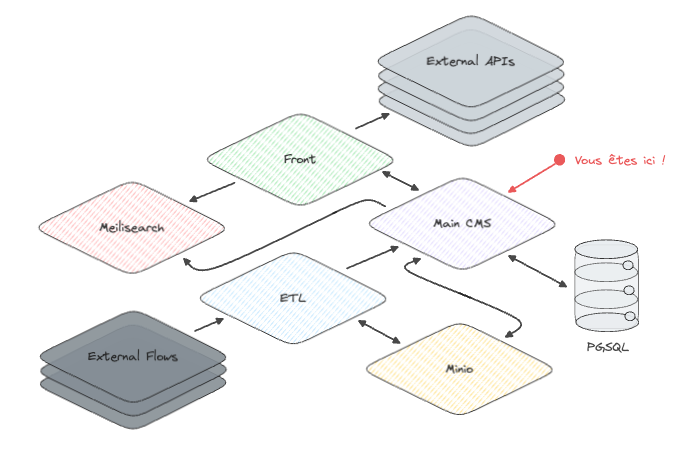
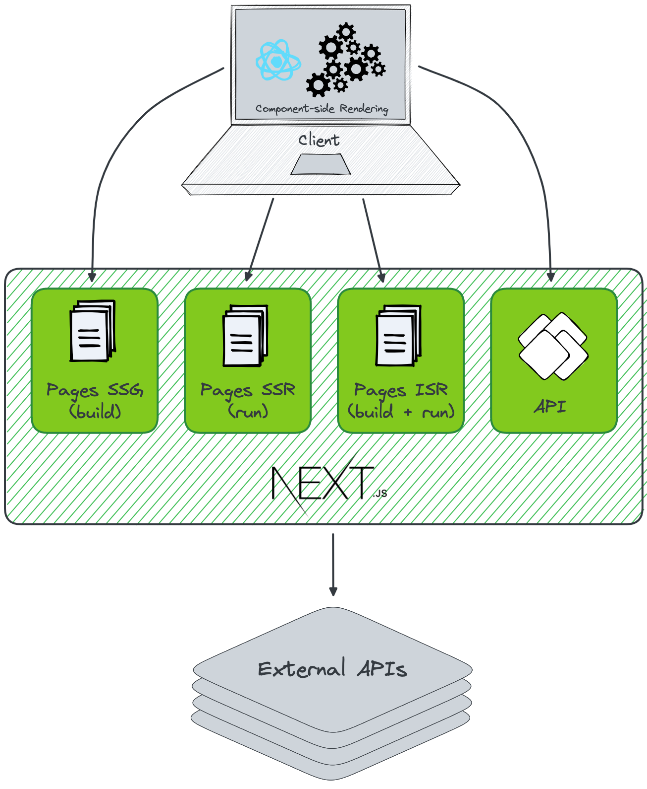

# Architecture
_20 Avril 2023 (mis à jour le 29 Juillet 2024)_

## Architecture globale

## Architecture détaillée

Propulsé par NextJS, l'application est découpée de la sorte :
- Une partie `client` qui présente ce qui est affiché à nos utilisateurs
- Une partie `server` qui nous sert d'interfaces avec [les services externes consommés](./ecosysteme#services-externes)

## Technologies

* Langage : TypeScript
* Framework : NextJS
* Environnement serveur : NodeJS
* Tests : Jest + React Testing library + Cypress
* Style : CSS Modules + Sass
* Package Manager : npm

## Génération des pages web

L'application exploite les possibilités de NextJS pour optimiser les performances lors de la génération des pages web :
- Des pages statiques (SSG), générées lors de l'étape de `build` de l'application pour quelques "pages de base" (accueil, pages de recherche, etc.)
- Des pages statiques créées à la demande et mises à jour périodiquement (ISR) pour les pages se basant sur un service externe présentant des données froides (description d'offre, lien avec le CMS, etc.)
- Des pages générées dynamiquement (SSR) quand celles-ci présentent des données chaudes (pas de page répondant à ce critère)

Les pages de recherche sont mise à jour côté client (CSR) grâce à des requêtes HTTP entre le client et le BFF (back-for-front).
